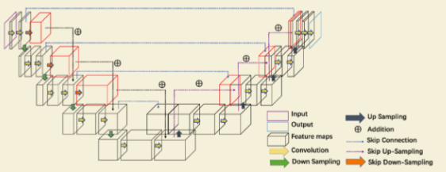

CSR-Net：多目标舟状骨骨折分割的跨尺度残差网络
---

# 研究背景

### 舟状骨特点

舟状骨的血液供应不足，导致骨折延迟愈合以及缺血性坏死
螺钉骨手术需要精确定位舟状骨及其骨折面，并找到合适的角度和植入螺钉，由于舟状骨和多腕关节体积小，精确的螺钉植入对临床医生的操作是一个挑战。
腕关节CT图像能直观显示舟状骨骨折及其骨折面，根据实际的临床观察在确定最佳的螺钉放置位置。
由于人工分割工作量大、精度要求高，三维重建技术无法在临床上得到推广，因此人们开始寻找结合人工智能的方法进行图像分割。

### 历史研究

- Long等人提出使用全卷积网络实现图像分割
- Ronneberger等人为了提高分割精度提出了U-Net，实现了超分辨率分割
- Milleri等人为了达到三位体积的分割引入了V-Net
- 在V-Net中主要处理二分类问题，Dice loss就是训练的代价，因此Yu等人提出了密集连接的体积卷积网(DenseVoxNet)

### 难点

1. 舟状骨在手部骨骼CT图中占据的区域很小，训练期间正负样本之间严重不匹配
2. 腕关节散在舟状骨周围；它们的图像特征几乎相同，相似的结构会干扰舟状骨识别
3. 不同个体的舟状骨形状和大小不同，难以准确提缺几何特征

# 方法设计

## 特点

舟状骨骨折的三维重建能够准确地显示骨折面，为涉及螺钉放置的手术计划提供支持，CSR-Net建立了不同尺度特征之间的紧密联系

## CSR-Net

不同层的特征用来通过CSR连接进行融合，从而实现尺度和通道的转换
输出层和通道的结构设计将CSR-Net建立为一个多目标体系结构，可以同步实现舟状骨骨折和手骨的分割
为了实现跨尺度的特征融合，CSR-Net在层级之间使用残差连接，提升了网络的特征提取能力

图1 CSR-Net工作流

图2 CSR-Net结构

# 实验结果

### 数据来源

对65张舟状骨骨折的CT图进行测试，使用东芝Aquillion PRIME设备从桡骨和尺骨中部扫描到顶部或中上部；对于指骨的长度，扫描参数设置为120kV电压、180mA电流和0.5mm切片间距

### 实验结果

表1 不同网络手骨分割结果

| 方法           | ACC(%) | SEC(%) | Spe(%) | Dice(%) | Jaccard(%) |
| -------------- | ------ | ------ | ------ | ------- | ---------- |
| U-net          |$98.05\pm 1.21$|$97.88\pm 2.05$|$98.09\pm 1.14$|$91.87\pm 4.62$|$85.28\pm 7.47$|
| V-Net          |$98.04\pm 1.34$|$93.61\pm 4.24$|$98.72\pm 1.15$|$91.73\pm 4.76$|$85.07\pm 7.80$|
| DenseVoxNet    |$93.77\pm 5.67$|$97.46\pm 2.52$|$93.44\pm 6.23$|$79.18\pm 17.64$|$68.86\pm 22.78$|
| Residual U-Net |$97.87\pm 1.74$|$94.40\pm 3.88$|$98.40\pm 1.55$|$91.08\pm 6.41$|$84.20\pm 9.72$|
| CSR-Net        |$98.11\pm 1.27$|$95.21\pm 2.94$|$98.49\pm 1.28$|$91.92\pm 4.74$|$85.39\pm 7.62$|

表2 不同网络舟状骨骨折分割结果

| 方法           | ACC(%) | SEC(%) | Spe(%) | Dice(%) | Jaccard(%) |
| -------------- | ------ | ------ | ------ | ------- | ---------- |
| U-net          |$99.82\pm 0.28$|$93.44\pm 8.57$|$99.89\pm 0.16$|$91.04\pm 8.67$|$84.48\pm 11.81$|
| V-Net          |$99.83\pm 0.21$|$92.87\pm 3.57$|$99.89\pm 0.17$|$90.40\pm 5.67$|$82.93\pm 8.64$|
| DenseVoxNet    |$98.96\pm 0.87$|$62.32\pm 32.75$|$99.25\pm 0.91$|$48.48\pm 24.32$|$35.26\pm 20.71$|
| Residual U-Net |$99.82\pm 0.31$|$95.74\pm 2.76$|$99.85\pm 0.31$|$91.52\pm 6.78$|$84.97\pm 9.78$|
| CSR-Net        |$99.87\pm 0.10$|$91.79\pm 7.82$|$99.95\pm 0.05$|$92.25\pm 4.01$|$85.85\pm 6.64$|

# 总结

## 方法评价

CSR-Net实现了更高性能的手骨和舟状骨骨折分割，比起其他方法得到的骨折面更加清晰直观

## 下一步工作

残差连接会导致网络复杂，从而提升网络的训练难度，必须要配合数据增强提高数据泛化能力，使得网络更好收敛，下一步工作中要尝试构建跨尺度轻量化的残差连接